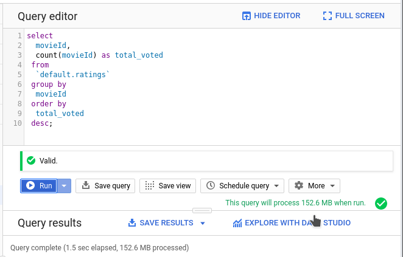
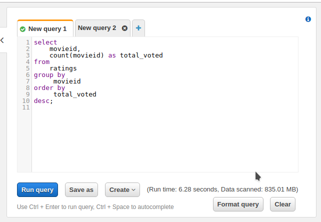

+++
title = "Aws Athena Atau Google Bigquery"
subtitle = ""

# Add a summary to display on homepage (optional).
summary = ""

date = 2019-07-18T01:57:36+07:00
draft = false

# Authors. Comma separated list, e.g. `["Bob Smith", "David Jones"]`.
authors = []

# Is this a featured post? (true/false)
featured = false

# Tags and categories
# For example, use `tags = []` for no tags, or the form `tags = ["A Tag", "Another Tag"]` for one or more tags.
tags = []
categories = []

# Projects (optional).
#   Associate this post with one or more of your projects.
#   Simply enter your project's folder or file name without extension.
#   E.g. `projects = ["deep-learning"]` references 
#   `content/project/deep-learning/index.md`.
#   Otherwise, set `projects = []`.
# projects = ["internal-project"]

# Featured image
# To use, add an image named `featured.jpg/png` to your page's folder. 
[image]
  # Caption (optional)
  caption = ""

  # Focal point (optional)
  # Options: Smart, Center, TopLeft, Top, TopRight, Left, Right, BottomLeft, Bottom, BottomRight
  focal_point = ""
+++
## Intro

Saya memiliki beberapa data csv yang ingin saya analisa, kali ini saya akan mencoba menggunakan big data analytics dari aws dan google. Dipilih karena "serverless" yang dalam artian saya hanya membayar sesuai dengan yang saya gunakan, tidak ada biaya idle atau maintenance, bayar cuma yang di eksekusi.

## Data yang digunakan

Saya menggunakan movie lens 20 M datasets, yang isinya seperti ini

```bash
faisal@who:~/ml-20m$ ls -lh
total 836M
-rw-r--r-- 1 faisal faisal 309M Okt 17  2016 genome-scores.csv
-rw-r--r-- 1 faisal faisal  18K Okt 17  2016 genome-tags.csv
-rw-r--r-- 1 faisal faisal 557K Okt 17  2016 links.csv
-rw-r--r-- 1 faisal faisal 1,4M Mar 31  2015 movies.csv
-rw-r--r-- 1 faisal faisal 509M Mar 31  2015 ratings.csv
-rw-r--r-- 1 faisal faisal  16M Mar 31  2015 tags.csv

faisal@who:~/ml-20m$ head ratings.csv 
userId,movieId,rating,timestamp
1,2,3.5,1112486027
1,29,3.5,1112484676
1,32,3.5,1112484819
1,47,3.5,1112484727
1,50,3.5,1112484580
1,112,3.5,1094785740
1,151,4.0,1094785734
1,223,4.0,1112485573
1,253,4.0,1112484940

faisal@who:~/ml-20m$ head movies.csv 
movieId,title,genres
1,Toy Story (1995),Adventure|Animation|Children|Comedy|Fantasy
2,Jumanji (1995),Adventure|Children|Fantasy
3,Grumpier Old Men (1995),Comedy|Romance
4,Waiting to Exhale (1995),Comedy|Drama|Romance
5,Father of the Bride Part II (1995),Comedy
6,Heat (1995),Action|Crime|Thriller
7,Sabrina (1995),Comedy|Romance
8,Tom and Huck (1995),Adventure|Children
9,Sudden Death (1995),Action
```

## AWS Athena

### Upload Data
Untuk menggunakan aws athena pertama kali saya akan upload ke s3.

```bash
# buat bucket
faisal@who:~/ml-20m$ aws s3 mb s3://warehouse-ml20m
make_bucket: warehouse-ml20m

# upload ke bucket
faisal@who:~/ml-20m$ aws s3 sync . s3://warehouse-ml20m
upload: ./genome-tags.csv to s3://warehouse-ml20m/genome-tags.csv 
upload: ./movies.csv to s3://warehouse-ml20m/movies.csv           
upload: ./links.csv to s3://warehouse-ml20m/links.csv            
upload: ./tags.csv to s3://warehouse-ml20m/tags.csv              
upload: ./genome-scores.csv to s3://warehouse-ml20m/genome-scores.csv
upload: ./ratings.csv to s3://warehouse-ml20m/ratings.csv
```

### Buat Tabel di Athena

Buka athena di aws, lalu masukan query

```sql
CREATE EXTERNAL TABLE IF NOT EXISTS default.ratings (
  `userid` int,
  `movieid` int,
  `rating` float,
  `timestamp` int 
)
ROW FORMAT SERDE 'org.apache.hadoop.hive.serde2.lazy.LazySimpleSerDe'
WITH SERDEPROPERTIES (
  'serialization.format' = ',',
  'field.delim' = ','
) LOCATION 's3://warehouse-ml20m/ratings.csv'
TBLPROPERTIES ('has_encrypted_data'='false');
```

## Google Big Query

### Upload data

Upload csv ke google storage

```bash
# buat bucket
faisal@who:~/ml-20m$ gsutil mb gs://warehouse-ml20m
Creating gs://warehouse-ml20m/...

# upload ke bucket
faisal@who:~/ml-20m$ gsutil rsync . gs://warehouse-ml20m
-----lot of output-----
Operation completed over 6 objects/835.0 MiB
```

### Load Data ke BigQuery

```bash
faisal@who:~/ml-20m$ bq load --skip_leading_rows=1 \
  --source_format=CSV \
  default.ratings \
  gs://warehouse-ml20m/ratings.csv \
  userId:STRING,movieId:INTEGER,rating:FLOAT,timestamp:INTEGER

Waiting on bqjob_r560703b039f7b3dd_0000016c092e6c68_1 ... (68s) Current status: DONE
```

## Query test

melihat seberapa banyak user yang melakukan rating ke suatu film

BigQuery



Athena



## Perbandingan harga

aws:

  - upload s3 835 MB = Free = $0
  - storage 835 MB = $0.023 per GB = $0.019205
  - query 835 MB = $5 per TB = $0.004175

bigquery

  - upload gs 835 MB = Free = $0
  - storage 835 MB = $0.026 per GB = $0.02171
  - BigQuery storage 835 MB = $0.026 per GB = $0.02171
  - query 152 MB = $5 per TB = $0.00076

## Kesimpulan

Karena optimasi columnar, secara kecepatan dan banyaknya scan data BigQuery lebih unggul dari pada athena.
mungkin jika di athena data di ubah ke columnar seperti parquet hasil akan berbeda.

Karena BigQuery melakukan insert terlebih dahulu dari storage, maka akan ada proses insert yang lama. Athena menggunakan
external table sehingga lebih cepat (tidak ada insert data). Tapi di bigquery sendiri mendukung external table.

Penggunaan storage pada bigquery lebih besar, untuk data mentah csv dan biquery.

Query editor di bigquery mampu menampilkan estimasi data yang akan di scan, yang sangat berguna karena menyangkut harga per query.
